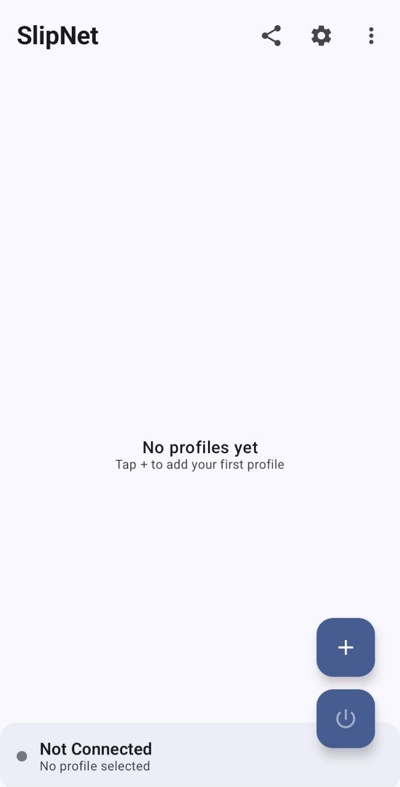
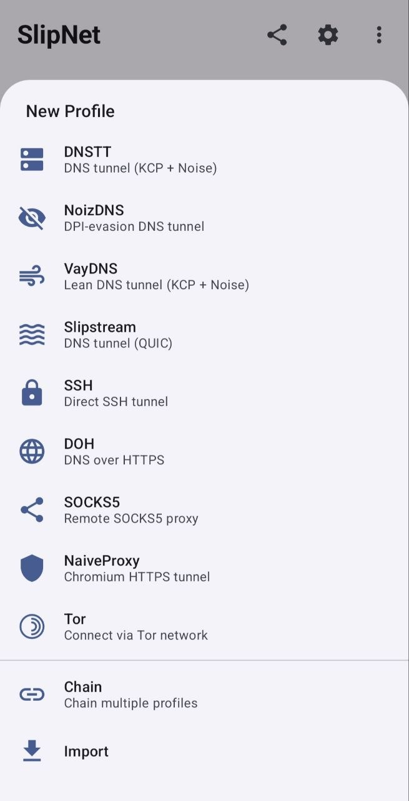
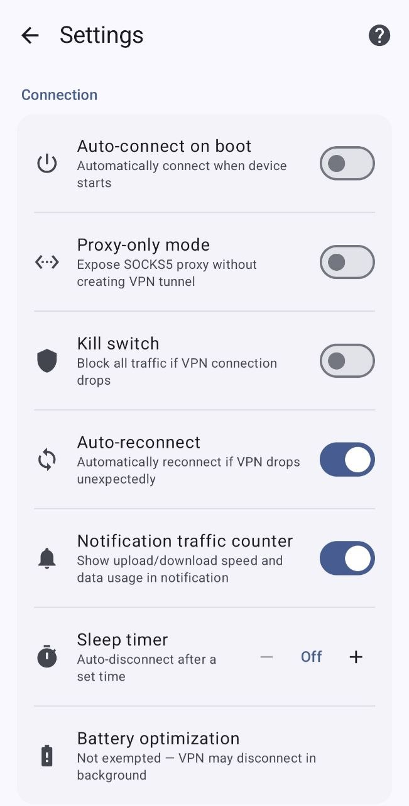

# TZVPN

> **TZVPN is NOT available on any app store.** Any version you find on Google Play, the Apple App Store, or any other marketplace is **not published by us** and may be outdated, modified, or unsafe. The only official source is this GitHub repository.

> Copyright (C) 2026 Iddy29


<p align="center">
  
</p>

A fast, modern VPN client featuring DNS tunneling with support for multiple protocols. Available as an Android app (Jetpack Compose + Kotlin) and a cross-platform CLI client (Go).

> **This is open-source anti-censorship software** designed to help users in countries with internet censorship access the free internet. It is comparable to [Tor](https://www.torproject.org/), [Psiphon](https://psiphon.ca/), [Outline VPN](https://getoutline.org/) (Google Jigsaw), and [dnstt](https://www.bamsoftware.com/software/dnstt/). This project does not target, exploit, or attack any systems — it is a client-side privacy tool used voluntarily by end users.

> Forked from [SlipNet](https://github.com/anonvector/SlipNet) by Anonvector — rebranded and maintained by [Iddy29](https://github.com/Iddy29).

## User Guide

Full step-by-step user guide (installation, profiles, scanner, troubleshooting, sharing & backup, security notes) — available in English and Persian:

- [English (PDF)](docs/TZVPN_User_Guide_EN.pdf)
- [فارسی (PDF)](docs/TZVPN_User_Guide_FA.pdf)
- [Markdown source (EN + FA)](docs/USER_GUIDE.md)

## Tunnel Types

TZVPN supports multiple tunnel types with optional SSH chaining:

| Tunnel Type | Protocol | Description |
|-------------|----------|-------------|
| **DNSTT** | KCP + Noise | Stable and reliable DNS tunneling |
| **DNSTT + SSH** | KCP + Noise + SSH | DNSTT with SSH chaining for zero DNS leaks |
| **NoizDNS** | KCP + Noise | DPI-resistant DNS tunneling |
| **NoizDNS + SSH** | KCP + Noise + SSH | NoizDNS with SSH chaining |
| **VayDNS** | KCP + Noise | Optimized DNS tunneling with configurable wire format |
| **VayDNS + SSH** | KCP + Noise + SSH | VayDNS with SSH chaining |
| **Slipstream** | QUIC | High-performance QUIC tunneling |
| **Slipstream + SSH** | QUIC + SSH | Slipstream with SSH chaining |
| **SSH** | SSH | Standalone SSH tunnel (no DNS tunneling) |
| **NaiveProxy** | HTTPS (Chromium) | HTTPS tunnel with authentic Chrome TLS fingerprinting |
| **NaiveProxy + SSH** | HTTPS + SSH | NaiveProxy with SSH chaining for extra encryption |
| **DOH** | DNS over HTTPS | DNS-only encryption via HTTPS (RFC 8484) |
| **Tor** | Tor Network | Connect via Tor with Snowflake, obfs4, Meek, or custom bridges |

**Note:** DNSTT is the default and recommended tunnel type for most users. NoizDNS adds DPI resistance on top of DNSTT for censored networks. VayDNS offers an optimized wire format with configurable QNAME lengths, record types, and rate limiting. SSH variants add an extra layer of encryption and can prevent DNS leaks.

## Features

- **Modern UI**: Built entirely with Jetpack Compose and Material 3 design
- **Multiple Tunnel Types**: DNSTT, NoizDNS, VayDNS, Slipstream, SSH, NaiveProxy, DOH, and Tor with optional SSH chaining
- **NoizDNS**: DPI-resistant DNS tunneling with optional stealth mode
- **VayDNS**: Optimized DNS tunneling with configurable wire format, record types, QNAME lengths, and rate limiting
- **SSH Tunneling**: Chain SSH through DNSTT, NoizDNS, VayDNS, Slipstream, or NaiveProxy, or use standalone SSH
- **SSH over TLS**: Wrap SSH in TLS with custom SNI for domain fronting and DPI bypass
- **SSH over WebSocket**: Tunnel SSH through WebSocket (ws/wss) for CDN-based proxying (Cloudflare, etc.)
- **SSH over HTTP CONNECT**: Route SSH through HTTP CONNECT proxies with custom Host headers
- **SSH Payload Injection**: Send raw bytes before SSH handshake to disguise traffic for DPI bypass
- **NaiveProxy**: Chromium-based HTTPS tunnel with authentic TLS fingerprinting to evade DPI
- **DNS over HTTPS**: Encrypt DNS queries via HTTPS without tunneling other traffic
- **DNS Transport Selection**: Choose UDP, DoT, or DoH for DNSTT DNS resolution
- **SSH Cipher Selection**: Choose between AES-128-GCM, ChaCha20, and AES-128-CTR
- **DNS Server Scanning**: Automatically discover and test compatible DNS servers with EDNS probing, NXDOMAIN hijacking detection, and country-based IP range scanning
- **Multiple Profiles**: Create and manage multiple server configurations
- **Configurable Proxy**: Set custom listen address and port
- **Quick Settings Tile**: Toggle VPN connection directly from the notification shade
- **Auto-connect on Boot**: Optionally reconnect VPN when device starts
- **APK Sharing**: Share the app via Bluetooth or other methods in case of internet shutdowns
- **Debug Logging**: Toggle detailed traffic logs for troubleshooting
- **Dark Mode**: Full support for system-wide dark theme

## Server Setup

To use this client, you must run a compatible server. The official, supported way is **SlipGate** — a one-command Linux installer that sets up every protocol TZVPN supports (DNSTT, NoizDNS, VayDNS, Slipstream, SSH, NaiveProxy, VLESS).

[**SlipGate**](https://github.com/anonvector/slipgate) — one-command server installer with interactive management menu

## Screenshots

<p align="center">
  
  &nbsp;&nbsp;
  
  &nbsp;&nbsp;
  
</p>

## Requirements

### Android App
- Android 7.0 (API 24) or higher
- Android Studio Hedgehog (2023.1.1) or later
- JDK 17
- Rust toolchain (for building the native library)
- Android NDK 29

### CLI Client
- Go 1.24+ (auto-downloaded via GOTOOLCHAIN if needed)
- No external dependencies — fully self-contained (native Go SSH, no `ssh`/`sshpass` binaries needed)

## Building (Android)

### Prerequisites

1. **Install Rust**
   ```bash
   curl --proto '=https' --tlsv1.2 -sSf [https://sh.rustup.rs](https://sh.rustup.rs) | sh
