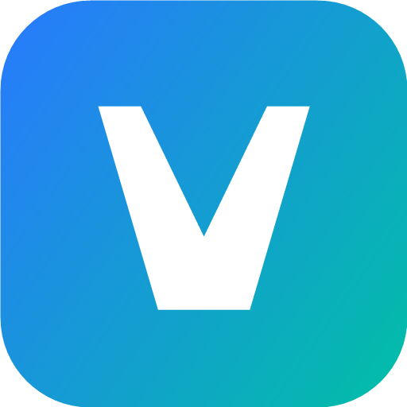

# VPN-TZ

<p align="center">
  
</p>

A fast, modern VPN client featuring DNS tunneling with support for multiple protocols. Available as an Android app (Jetpack Compose + Kotlin) and a cross-platform CLI client (Go).

> **VPN-TZ is open-source anti-censorship software** designed to help users in countries with internet censorship access the free internet. It is comparable to [Tor](https://www.torproject.org/), [Psiphon](https://psiphon.ca/), [Outline VPN](https://getoutline.org/), and [dnstt](https://www.bamsoftware.com/software/dnstt/). This project does not target, exploit, or attack any systems — it is a client-side privacy tool used voluntarily by end users.

## Tunnel Types

VPN-TZ supports multiple tunnel types with optional SSH chaining:

| Tunnel Type | Protocol | Description |
|-------------|----------|-------------|
| **DNSTT** | KCP + Noise | Stable and reliable DNS tunneling |
| **DNSTT + SSH** | KCP + Noise + SSH | DNSTT with SSH chaining for zero DNS leaks |
| **NoizDNS** | KCP + Noise | DPI-resistant DNS tunneling |
| **NoizDNS + SSH** | KCP + Noise + SSH | NoizDNS with SSH chaining |
| **VayDNS** | KCP + Noise | Optimized DNS tunneling with configurable wire format |
| **VayDNS + SSH** | KCP + Noise + SSH | VayDNS with SSH chaining |
| **tz-kitonga** | QUIC | High-performance QUIC tunneling |
| **tz-kitonga + SSH** | QUIC + SSH | tz-kitonga with SSH chaining |
| **SSH** | SSH | Standalone SSH tunnel (no DNS tunneling) |
| **NaiveProxy** | HTTPS (Chromium) | HTTPS tunnel with authentic Chrome TLS fingerprinting |
| **NaiveProxy + SSH** | HTTPS + SSH | NaiveProxy with SSH chaining for extra encryption |
| **VLESS** | WebSocket + TLS | CDN-fronted VLESS tunnel with SNI fragmentation |
| **VLESS + REALITY** | REALITY (uTLS) | VLESS over xtls REALITY |
| **Hysteria2** | QUIC | High-performance QUIC proxy with optional Salamander obfuscation |
| **DOH** | DNS over HTTPS | DNS-only encryption via HTTPS (RFC 8484) |
| **Tor** | Tor Network | Connect via Tor with Snowflake, obfs4, Meek, or custom bridges |

**Note:** DNSTT is the default and recommended tunnel type for most users. SSH variants add an extra layer of encryption and can prevent DNS leaks.

## Features

- **Modern UI**: Built entirely with Jetpack Compose and Material 3 design
- **Multiple Tunnel Types**: DNSTT, NoizDNS, VayDNS, tz-kitonga, SSH, NaiveProxy, DOH, and Tor with optional SSH chaining
- **SSH Tunneling**: Chain SSH through DNS tunnels or use standalone
- **SSH over TLS / WebSocket / HTTP CONNECT**: Disguise SSH traffic for DPI bypass
- **NaiveProxy**: Chromium-based HTTPS tunnel with authentic TLS fingerprinting
- **DNS over HTTPS**: Encrypt DNS queries via HTTPS without tunneling other traffic
- **DNS Transport Selection**: Choose UDP, DoT, or DoH for DNSTT DNS resolution
- **SSH Cipher Selection**: AES-128-GCM, ChaCha20, and AES-128-CTR
- **DNS Server Scanning**: Automatically discover and test compatible DNS servers
- **Multiple Profiles**: Create and manage multiple server configurations
- **Configurable Proxy**: Set custom listen address and port
- **Quick Settings Tile**: Toggle VPN connection directly from the notification shade
- **Auto-connect on Boot**: Optionally reconnect VPN when device starts
- **APK Sharing**: Share the app via Bluetooth or other methods in case of internet shutdowns
- **Debug Logging**: Toggle detailed traffic logs for troubleshooting
- **Dark Mode / AMOLED**: Full support for system-wide dark theme

## Requirements

### Android App
- Android 7.0 (API 24) or higher
- Android Studio Hedgehog (2023.1.1) or later
- JDK 17
- Rust toolchain (for building the native library)
- Android NDK 29

### CLI Client
- Go 1.24+
- No external dependencies — fully self-contained

## Building (Android)

```bash
# 1. Install Rust (https://rustup.rs)
# 2. Open the project in Android Studio, or:
./gradlew assembleFullRelease
```

APKs are written to `app/build/outputs/apk/full/release/`.

## Building (CLI)

```bash
cd cli
go build -o vpntz .
```

## Server Setup

To use this client, you must run a compatible server. Use **TzGate** — a server installer that sets up every protocol VPN-TZ supports.

See the [tzgate directory](tzgate/) for the one-command server installer with an interactive management menu.

## License

Copyright (C) 2026 VPN-TZ contributors

This program is free software: you can redistribute it and/or modify it under the terms of the GNU Affero General Public License as published by the Free Software Foundation, either version 3 of the License, or (at your option) any later version. See [LICENSE](LICENSE).

This project is based on the open-source [SlipNet](https://github.com/anonvector/SlipNet) project (AGPL-3.0) and includes components from third-party open-source projects. See [THIRD_PARTY_NOTICES.md](THIRD_PARTY_NOTICES.md) for details.

## Contributing

Issues and pull requests are welcome. By participating, you agree that your contributions will be licensed under the AGPL-3.0.
